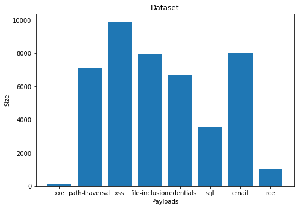

# A Deep Learning Approach to Web Application Firewall

Code for the paper: https://medium.com/@tarcisioma/a-deep-learning-approach-to-web-application-firewall-c6190a9bd31a


## Using Deep Learning to classify API attacks


# Installing dependencies and data


```python
# !pip3 install -q tensorflow_gpu=
# !pip install --upgrade tensorflow
!pip install tensorflow==2.1
```


```python
import tensorflow as tf
print(tf.__version__)
```

    2.2.0-rc3


```python
!pip3 install gast==0.3.2
```


```python
!pip3 install -q ktrain

```

         |████████████████████████████████| 25.2MB 129kB/s 
         |████████████████████████████████| 421.8MB 16kB/s 
    WARNING: Retrying (Retry(total=4, connect=None, read=None, redirect=None, status=None)) after connection broken by 'ProtocolError('Connection aborted.', ConnectionResetError(104, 'Connection reset by peer'))': /simple/scikit-learn/
         |████████████████████████████████| 6.7MB 59.4MB/s 
         |████████████████████████████████| 983kB 40.0MB/s 
         |████████████████████████████████| 245kB 45.8MB/s 
         |████████████████████████████████| 675kB 44.3MB/s 
         |████████████████████████████████| 471kB 42.2MB/s 
         |████████████████████████████████| 450kB 45.9MB/s 
         |████████████████████████████████| 3.9MB 46.8MB/s 
         |████████████████████████████████| 890kB 37.0MB/s 
         |████████████████████████████████| 3.8MB 43.4MB/s 
         |████████████████████████████████| 1.1MB 47.1MB/s 
    [?25h  Building wheel for ktrain (setup.py) ... [?25l[?25hdone
      Building wheel for keras-bert (setup.py) ... [?25l[?25hdone
      Building wheel for langdetect (setup.py) ... [?25l[?25hdone
      Building wheel for seqeval (setup.py) ... [?25l[?25hdone
      Building wheel for syntok (setup.py) ... [?25l[?25hdone
      Building wheel for gast (setup.py) ... [?25l[?25hdone
      Building wheel for keras-transformer (setup.py) ... [?25l[?25hdone
      Building wheel for sacremoses (setup.py) ... [?25l[?25hdone
      Building wheel for keras-pos-embd (setup.py) ... [?25l[?25hdone
      Building wheel for keras-multi-head (setup.py) ... [?25l[?25hdone
      Building wheel for keras-layer-normalization (setup.py) ... [?25l[?25hdone
      Building wheel for keras-position-wise-feed-forward (setup.py) ... [?25l[?25hdone
      Building wheel for keras-embed-sim (setup.py) ... [?25l[?25hdone
      Building wheel for keras-self-attention (setup.py) ... [?25l[?25hdone
    ERROR: tensorflow-probability 0.10.0 has requirement gast>=0.3.2, but you'll have gast 0.2.2 which is incompatible.


```python
import ktrain
print(ktrain.__version__)
```

    0.16.2


```python
from google.colab import drive
drive.mount('/content/gdrive')
```

    Go to this URL in a browser: https://accounts.google.com/o/oauth2/auth?client_id=947318989803-6bn6qk8qdgf4n4g3pfee6491hc0brc4i.apps.googleusercontent.com&redirect_uri=urn%3aietf%3awg%3aoauth%3a2.0%3aoob&response_type=code&scope=email%20https%3a%2f%2fwww.googleapis.com%2fauth%2fdocs.test%20https%3a%2f%2fwww.googleapis.com%2fauth%2fdrive%20https%3a%2f%2fwww.googleapis.com%2fauth%2fdrive.photos.readonly%20https%3a%2f%2fwww.googleapis.com%2fauth%2fpeopleapi.readonly
    
    Enter your authorization code:
    ··········
    Mounted at /content/gdrive


# Load the dataset


```python
import sys
import os
import random
```


```python
LABELS = {}
INV_LABELS = {}
for i, label in enumerate(os.listdir('gdrive/My Drive/datasets-payload-identifier/')):
  LABELS[i] = label
  INV_LABELS[label] = i
```


```python
from sklearn.model_selection import train_test_split
dataset_size = {}
target_names = []

def get_dataset(path, test_size=0.25, random_state=42):
  X = []
  Y = []
  for label in os.listdir(path):
    target_names.append(label)
    with open(os.path.join('gdrive/My Drive/datasets-payload-identifier/', label, 'ALL_FILES.txt')) as f:
      lines = f.readlines()
      dataset_size[label] = len(lines)
      for payload in lines:
        if("\n" in payload):
          X.append(payload.replace("\n", ""))
          Y.append(INV_LABELS[label])
          
  return train_test_split(X, Y, test_size=test_size, random_state=random_state)

x_train, x_test, y_train, y_test = get_dataset('gdrive/My Drive/datasets-payload-identifier/')
```


```python
count = 1
for i in y_test:
  if(LABELS[i] == ''):
    count+=1

print(count)
```

    2010


```python
import matplotlib.pyplot as plt
%matplotlib inline
ax = plt.figure().add_axes([0,0,1,1])
print("Dataset size: ")
for k, v in dataset_size.items():
  print("Payload: {} - Size: {}".format(k, v))
payloads = dataset_size.keys()
size = dataset_size.values()
ax.bar(payloads, size)
plt.title("Dataset")
plt.xlabel("Payloads")
plt.ylabel("Size")
plt.show()
```

    Dataset size: 
    Payload: xxe - Size: 115
    Payload: path-traversal - Size: 7090
    Payload: xss - Size: 9882
    Payload: file-inclusion - Size: 7935
    Payload: credentials - Size: 6702
    Payload: sql - Size: 3550
    Payload: email - Size: 7996
    Payload: rce - Size: 1036


    

    


# Create the model


```python
import ktrain
from ktrain import text
# distillbert - roberta - xlm - albert - bert

#MODELS = ['bert-base-uncased', 'distilbert-base-uncased', 'roberta-large', 'xlm-roberta-base', 'albert-base-v2']
MODEL_NAME = 'distilbert-base-uncased'
#for MODEL_NAME in MODELS:
print("Running model: ".upper(), MODEL_NAME.upper())
print("\n\n\n")
t = text.Transformer(MODEL_NAME, maxlen=500, classes=target_names)
trn = t.preprocess_train(x_train, y_train)
val = t.preprocess_test(x_test, y_test)
model = t.get_classifier()
learner = ktrain.get_learner(model, train_data=trn, val_data=val, batch_size=6)
learner.fit_onecycle(5e-5, 1)
print("Validating: ")
learner.validate(class_names=t.get_classes())
print("Top losses: ")
learner.view_top_losses(preproc=t)
#print("Confusion Matrix: ")
#predictor = ktrain.get_predictor(learner.model, preproc=t)
#predictor.analyze_valid((x_test, y_test))
print("Finished running model: ", MODEL_NAME)

```

    RUNNING MODEL:  DISTILBERT-BASE-UNCASED
    
    
    
    


    /usr/local/lib/python3.6/dist-packages/ktrain/text/preprocessor.py:367: UserWarning: The class_names argument is replacing the classes argument. Please update your code.
      warnings.warn('The class_names argument is replacing the classes argument. Please update your code.')


    preprocessing train...
    language: en
    train sequence lengths:
    	mean : 2
    	95percentile : 5
    	99percentile : 10


    preprocessing test...
    language: en
    test sequence lengths:
    	mean : 2
    	95percentile : 5
    	99percentile : 9


    
    
    begin training using onecycle policy with max lr of 5e-05...
    Train for 5538 steps, validate for 347 steps
    5538/5538 [==============================] - 1425s 257ms/step - loss: 0.1665 - accuracy: 0.9596 - val_loss: 0.0491 - val_accuracy: 0.9855
    Validating: 
                    precision    recall  f1-score   support
    
               xxe       0.95      0.71      0.82        28
    path-traversal       0.99      0.96      0.98      1831
               xss       1.00      1.00      1.00      2467
    file-inclusion       0.96      0.99      0.98      1947
       credentials       0.99      0.99      0.99      1656
               sql       0.98      0.98      0.98       880
             email       1.00      1.00      1.00      2009
               rce       0.94      0.93      0.93       257
    
          accuracy                           0.99     11075
         macro avg       0.98      0.95      0.96     11075
      weighted avg       0.99      0.99      0.99     11075
    
    Top losses: 
    ----------
    id:6149 | loss:9.09 | true:xxe | pred:sql)
    
    ----------
    id:2742 | loss:8.17 | true:credentials | pred:sql)
    
    ----------
    id:7819 | loss:8.04 | true:credentials | pred:email)
    
    ----------
    id:1705 | loss:7.74 | true:sql | pred:credentials)
    
    Finished running model:  distilbert-base-uncased


# Predicting new payloads


```python
predictor = ktrain.get_predictor(learner.model, preproc=t)
```


```python
predictor.predict(";wget 192.168.1.1 -c -a;ping 12313;")
```


    'rce'


```python
predictor.predict_proba(";wget 192.168.1.1 -c -a;ping 12313;")

```


    array([9.49885987e-04, 3.35088174e-04, 2.64028879e-03, 1.36631366e-03,
           3.13900970e-03, 7.95728900e-03, 1.02633625e-04, 9.83509600e-01],
          dtype=float32)


```python
!pip3 install -q git+https://github.com/amaiya/eli5@tfkeras_0_10_1
```

      Building wheel for eli5 (setup.py) ... [?25l[?25hdone


```python
predictor.explain(testes[0])
```


    <style>
    table.eli5-weights tr:hover {
        filter: brightness(85%);
    }
</style>


        <p style="margin-bottom: 0.5em; margin-top: 0em">
            <b>

        y=sql

</b>


    (probability <b>1.000</b>, score <b>9.986</b>)

top features
        </p>

    <table class="eli5-weights"
           style="border-collapse: collapse; border: none; margin-top: 0em; table-layout: auto; margin-bottom: 2em;">
        <thead>
        <tr style="border: none;">

                <th style="padding: 0 1em 0 0.5em; text-align: right; border: none;" title="Feature contribution already accounts for the feature value (for linear models, contribution = weight * feature value), and the sum of feature contributions is equal to the score or, for some classifiers, to the probability. Feature values are shown if &quot;show_feature_values&quot; is True.">
                    Contribution<sup>?</sup>
                </th>

            <th style="padding: 0 0.5em 0 0.5em; text-align: left; border: none;">Feature</th>

        </tr>
        </thead>
        <tbody>

            <tr style="background-color: hsl(120, 100.00%, 80.00%); border: none;">
    <td style="padding: 0 1em 0 0.5em; text-align: right; border: none;">
        +4.856
    </td>
    <td style="padding: 0 0.5em 0 0.5em; text-align: left; border: none;">
        or
    </td>

</tr>

            <tr style="background-color: hsl(120, 100.00%, 87.86%); border: none;">
    <td style="padding: 0 1em 0 0.5em; text-align: right; border: none;">
        +2.380
    </td>
    <td style="padding: 0 0.5em 0 0.5em; text-align: left; border: none;">
        1¼1
    </td>

</tr>

            <tr style="background-color: hsl(120, 100.00%, 88.47%); border: none;">
    <td style="padding: 0 1em 0 0.5em; text-align: right; border: none;">
        +2.210
    </td>
    <td style="padding: 0 0.5em 0 0.5em; text-align: left; border: none;">
        2¼2
    </td>

</tr>

            <tr style="background-color: hsl(120, 100.00%, 95.69%); border: none;">
    <td style="padding: 0 1em 0 0.5em; text-align: right; border: none;">
        +0.541
    </td>
    <td style="padding: 0 0.5em 0 0.5em; text-align: left; border: none;">
        &lt;BIAS&gt;
    </td>

</tr>


        </tbody>
    </table>


```python
predictor.explain(testes[5])

```


    <style>
    table.eli5-weights tr:hover {
        filter: brightness(85%);
    }
</style>


        <p style="margin-bottom: 0.5em; margin-top: 0em">
            <b>

        y=xss

</b>


    (probability <b>1.000</b>, score <b>11.000</b>)

top features
        </p>

    <table class="eli5-weights"
           style="border-collapse: collapse; border: none; margin-top: 0em; table-layout: auto; margin-bottom: 2em;">
        <thead>
        <tr style="border: none;">

                <th style="padding: 0 1em 0 0.5em; text-align: right; border: none;" title="Feature contribution already accounts for the feature value (for linear models, contribution = weight * feature value), and the sum of feature contributions is equal to the score or, for some classifiers, to the probability. Feature values are shown if &quot;show_feature_values&quot; is True.">
                    Contribution<sup>?</sup>
                </th>

            <th style="padding: 0 0.5em 0 0.5em; text-align: left; border: none;">Feature</th>

        </tr>
        </thead>
        <tbody>

            <tr style="background-color: hsl(120, 100.00%, 80.00%); border: none;">
    <td style="padding: 0 1em 0 0.5em; text-align: right; border: none;">
        +4.419
    </td>
    <td style="padding: 0 0.5em 0 0.5em; text-align: left; border: none;">
        script
    </td>

</tr>

            <tr style="background-color: hsl(120, 100.00%, 89.72%); border: none;">
    <td style="padding: 0 1em 0 0.5em; text-align: right; border: none;">
        +1.707
    </td>
    <td style="padding: 0 0.5em 0 0.5em; text-align: left; border: none;">
        0
    </td>

</tr>

            <tr style="background-color: hsl(120, 100.00%, 89.88%); border: none;">
    <td style="padding: 0 1em 0 0.5em; text-align: right; border: none;">
        +1.670
    </td>
    <td style="padding: 0 0.5em 0 0.5em; text-align: left; border: none;">
        alert
    </td>

</tr>

            <tr style="background-color: hsl(120, 100.00%, 90.89%); border: none;">
    <td style="padding: 0 1em 0 0.5em; text-align: right; border: none;">
        +1.438
    </td>
    <td style="padding: 0 0.5em 0 0.5em; text-align: left; border: none;">
        type¼vbscript
    </td>

</tr>

            <tr style="background-color: hsl(120, 100.00%, 91.09%); border: none;">
    <td style="padding: 0 1em 0 0.5em; text-align: right; border: none;">
        +1.393
    </td>
    <td style="padding: 0 0.5em 0 0.5em; text-align: left; border: none;">
        msgbox
    </td>

</tr>

            <tr style="background-color: hsl(120, 100.00%, 95.16%); border: none;">
    <td style="padding: 0 1em 0 0.5em; text-align: right; border: none;">
        +0.582
    </td>
    <td style="padding: 0 0.5em 0 0.5em; text-align: left; border: none;">
        &lt;BIAS&gt;
    </td>

</tr>


            <tr style="background-color: hsl(0, 100.00%, 99.02%); border: none;">
    <td style="padding: 0 1em 0 0.5em; text-align: right; border: none;">
        -0.060
    </td>
    <td style="padding: 0 0.5em 0 0.5em; text-align: left; border: none;">
        type¼vbscript msgbox
    </td>

</tr>

            <tr style="background-color: hsl(0, 100.00%, 98.13%); border: none;">
    <td style="padding: 0 1em 0 0.5em; text-align: right; border: none;">
        -0.150
    </td>
    <td style="padding: 0 0.5em 0 0.5em; text-align: left; border: none;">
        script script
    </td>

</tr>


        </tbody>
    </table>


```python
predictor.explain(testes[10])

```


    <style>
    table.eli5-weights tr:hover {
        filter: brightness(85%);
    }
</style>


        <p style="margin-bottom: 0.5em; margin-top: 0em">
            <b>

        y=xss

</b>


    (probability <b>1.000</b>, score <b>12.494</b>)

top features
        </p>

    <table class="eli5-weights"
           style="border-collapse: collapse; border: none; margin-top: 0em; table-layout: auto; margin-bottom: 2em;">
        <thead>
        <tr style="border: none;">

                <th style="padding: 0 1em 0 0.5em; text-align: right; border: none;" title="Feature contribution already accounts for the feature value (for linear models, contribution = weight * feature value), and the sum of feature contributions is equal to the score or, for some classifiers, to the probability. Feature values are shown if &quot;show_feature_values&quot; is True.">
                    Contribution<sup>?</sup>
                </th>

            <th style="padding: 0 0.5em 0 0.5em; text-align: left; border: none;">Feature</th>

        </tr>
        </thead>
        <tbody>

            <tr style="background-color: hsl(120, 100.00%, 80.00%); border: none;">
    <td style="padding: 0 1em 0 0.5em; text-align: right; border: none;">
        +2.641
    </td>
    <td style="padding: 0 0.5em 0 0.5em; text-align: left; border: none;">
        alert
    </td>

</tr>

            <tr style="background-color: hsl(120, 100.00%, 81.32%); border: none;">
    <td style="padding: 0 1em 0 0.5em; text-align: right; border: none;">
        +2.395
    </td>
    <td style="padding: 0 0.5em 0 0.5em; text-align: left; border: none;">
        script
    </td>

</tr>

            <tr style="background-color: hsl(120, 100.00%, 82.97%); border: none;">
    <td style="padding: 0 1em 0 0.5em; text-align: right; border: none;">
        +2.099
    </td>
    <td style="padding: 0 0.5em 0 0.5em; text-align: left; border: none;">
        x
    </td>

</tr>

            <tr style="background-color: hsl(120, 100.00%, 84.29%); border: none;">
    <td style="padding: 0 1em 0 0.5em; text-align: right; border: none;">
        +1.870
    </td>
    <td style="padding: 0 0.5em 0 0.5em; text-align: left; border: none;">
        0
    </td>

</tr>

            <tr style="background-color: hsl(120, 100.00%, 89.61%); border: none;">
    <td style="padding: 0 1em 0 0.5em; text-align: right; border: none;">
        +1.036
    </td>
    <td style="padding: 0 0.5em 0 0.5em; text-align: left; border: none;">
        img
    </td>

</tr>

            <tr style="background-color: hsl(120, 100.00%, 89.71%); border: none;">
    <td style="padding: 0 1em 0 0.5em; text-align: right; border: none;">
        +1.021
    </td>
    <td style="padding: 0 0.5em 0 0.5em; text-align: left; border: none;">
        src¼
    </td>

</tr>

            <tr style="background-color: hsl(120, 100.00%, 90.33%); border: none;">
    <td style="padding: 0 1em 0 0.5em; text-align: right; border: none;">
        +0.934
    </td>
    <td style="padding: 0 0.5em 0 0.5em; text-align: left; border: none;">
        onerror¼
    </td>

</tr>

            <tr style="background-color: hsl(120, 100.00%, 93.28%); border: none;">
    <td style="padding: 0 1em 0 0.5em; text-align: right; border: none;">
        +0.556
    </td>
    <td style="padding: 0 0.5em 0 0.5em; text-align: left; border: none;">
        &lt;BIAS&gt;
    </td>

</tr>


            <tr style="background-color: hsl(0, 100.00%, 98.61%); border: none;">
    <td style="padding: 0 1em 0 0.5em; text-align: right; border: none;">
        -0.059
    </td>
    <td style="padding: 0 0.5em 0 0.5em; text-align: left; border: none;">
        src¼ x
    </td>

</tr>


        </tbody>
    </table>


```python
predictor.explain(testes[8])

```


    <style>
    table.eli5-weights tr:hover {
        filter: brightness(85%);
    }
</style>


        <p style="margin-bottom: 0.5em; margin-top: 0em">
            <b>

        y=sql

</b>


    (probability <b>1.000</b>, score <b>12.881</b>)

top features
        </p>

    <table class="eli5-weights"
           style="border-collapse: collapse; border: none; margin-top: 0em; table-layout: auto; margin-bottom: 2em;">
        <thead>
        <tr style="border: none;">

                <th style="padding: 0 1em 0 0.5em; text-align: right; border: none;" title="Feature contribution already accounts for the feature value (for linear models, contribution = weight * feature value), and the sum of feature contributions is equal to the score or, for some classifiers, to the probability. Feature values are shown if &quot;show_feature_values&quot; is True.">
                    Contribution<sup>?</sup>
                </th>

            <th style="padding: 0 0.5em 0 0.5em; text-align: left; border: none;">Feature</th>

        </tr>
        </thead>
        <tbody>

            <tr style="background-color: hsl(120, 100.00%, 80.00%); border: none;">
    <td style="padding: 0 1em 0 0.5em; text-align: right; border: none;">
        +3.653
    </td>
    <td style="padding: 0 0.5em 0 0.5em; text-align: left; border: none;">
        select
    </td>

</tr>

            <tr style="background-color: hsl(120, 100.00%, 80.13%); border: none;">
    <td style="padding: 0 1em 0 0.5em; text-align: right; border: none;">
        +3.620
    </td>
    <td style="padding: 0 0.5em 0 0.5em; text-align: left; border: none;">
        union
    </td>

</tr>

            <tr style="background-color: hsl(120, 100.00%, 80.82%); border: none;">
    <td style="padding: 0 1em 0 0.5em; text-align: right; border: none;">
        +3.442
    </td>
    <td style="padding: 0 0.5em 0 0.5em; text-align: left; border: none;">
        1
    </td>

</tr>

            <tr style="background-color: hsl(120, 100.00%, 88.38%); border: none;">
    <td style="padding: 0 1em 0 0.5em; text-align: right; border: none;">
        +1.682
    </td>
    <td style="padding: 0 0.5em 0 0.5em; text-align: left; border: none;">
        all
    </td>

</tr>

            <tr style="background-color: hsl(120, 100.00%, 95.13%); border: none;">
    <td style="padding: 0 1em 0 0.5em; text-align: right; border: none;">
        +0.485
    </td>
    <td style="padding: 0 0.5em 0 0.5em; text-align: left; border: none;">
        &lt;BIAS&gt;
    </td>

</tr>


        </tbody>
    </table>


# Saving the model


```python
predictor.save('distilbert-base-uncased-FINAL')
```

# Loading model


```python
reloaded_predictor = ktrain.load_predictor('gdrive/My Drive/BERT-TCC/distilbert-base-uncased-FINAL')
```

# Testing against anti-WAF


```python
testes  = ["' or 1¼1-- ' or 2¼2--", "' or 1¼1-- '¼'", '";alert(0);" "*alert(0)*"', "',alert(0),b' '%0aalert(0)%0a'", 
           'alert(0) %00alert(0)', '<script>alert(0)</script> <script type¼vbscript>MsgBox(0)', '</script>', '\' OR ""¼\' \'/**/OR/**/""¼\'', 
           "' union select 1;-- ' union all select 1;--", '<script>alert(0)</script> <SCRIPT>alert(0)</SCRIPT>', 
           '<script>alert(0)</script> ', '</img>', '', '</img>',
           '', '</img>', "</img>", '',
           '</img>', '</img>', '</img>', '</img>', '<marquee onstart¼alert(0)//>', '1 or 1¼1 (1)or(1)¼(1)', 'alert(0) deletetypeoftypeoftypeoftypeof', 'typeof',
           'typeofalert(0)', 'eval(name) x¼this.name', 'x(0?$:name+1)', "2a''-1 ^''0 2a''-1 ^ ' 0''' and (select mid(user,", "1 /1,1/ 1)from'mysql'.user limit 1)", 
           "rlike ''r", 'xyz¼this', 'zyx¼xyz[1].alert', 'zyx(1)', 'xyz¼Iterator([this]).next()', 'zyx¼xyz[1].alert', 'zyx(1)']
for exploit in testes:
  print(exploit, " >>> ", reloaded_predictor.predict(exploit))
```


    ' or 1¼1-- ' or 2¼2--  >>>  sql


    ' or 1¼1-- '¼'  >>>  sql


    ";alert(0);" "*alert(0)*"  >>>  xss


    ',alert(0),b' '%0aalert(0)%0a'  >>>  sql


    alert(0) %00alert(0)  >>>  xss


    <script>alert(0)</script> <script type¼vbscript>MsgBox(0)  >>>  xss


    </script>  >>>  xss


    ' OR ""¼' '/**/OR/**/""¼'  >>>  sql


    ' union select 1;-- ' union all select 1;--  >>>  sql


    <script>alert(0)</script> <SCRIPT>alert(0)</SCRIPT>  >>>  xss


    <script>alert(0)</script>   >>>  xss


    </img>  >>>  xss


    >>  xss


    onerror¼"alert(0)">  >>>  xss


    </img>  >>>  xss


      >>>  xss


    </img>  >>>  xss


    >>  xss


    onerror¼'alert(0)'></img>  >>>  xss


      >>>  xss


    </img>  >>>  xss


    >>  xss


    (0)//></img>  >>>  sql


    >>  xss


    alert(0)//></img>  >>>  xss


    >>  xss


    onload¼alert(0)//></img>  >>>  xss


    <marquee onstart¼alert(0)//>  >>>  xss


    1 or 1¼1 (1)or(1)¼(1)  >>>  sql


    alert(0) deletetypeoftypeoftypeoftypeof  >>>  xss


    typeof  >>>  credentials


    typeofalert(0)  >>>  xss


    eval(name) x¼this.name  >>>  rce


    x(0?$:name+1)  >>>  sql


    2a''-1 ^''0 2a''-1 ^ ' 0''' and (select mid(user,  >>>  sql


    1 /1,1/ 1)from'mysql'.user limit 1)  >>>  sql


    rlike ''r  >>>  sql


    xyz¼this  >>>  credentials


    zyx¼xyz[1].alert  >>>  xss


    zyx(1)  >>>  xss


    xyz¼Iterator([this]).next()  >>>  xss


    zyx¼xyz[1].alert  >>>  xss


    zyx(1)  >>>  xss


```python
# https://portswigger.net/web-security/cross-site-scripting/cheat-sheet
with open("gdrive/My Drive/BERT-TCC/xss_tests.txt", 'r') as f:
  xss_payloads = f.readlines()
xss_accuracy = 0
for payload in xss_payloads:
  if(reloaded_predictor.predict(payload)== 'xss'):
    xss_accuracy += 1
print("XSS lenght: {}".format(len(xss_payloads)))
print("XSS identified: {}".format(xss_accuracy))
```


    XSS lenght: 8492
    XSS identified: 8492


```python
# https://portswigger.net/web-security/sql-injection/cheat-sheet
with open("gdrive/My Drive/BERT-TCC/sql_tests.txt", 'r') as f:
  sql_payloads = f.readlines()
sql_accuracy = 0
for payload in sql_payloads:
  if(reloaded_predictor.predict(payload) == 'sql'):
    sql_accuracy += 1
print("sql lenght: {}".format(len(sql_payloads)))
print("sql identified: {}".format(sql_accuracy))
print('accuracy:', sql_accuracy*100/len(sql_payloads))
```


    sql lenght: 51
    sql identified: 45
    accuracy: 88.23529411764706


```python
reloaded_predictor.explain("admin' or '1'='1'--")
```


    <style>
    table.eli5-weights tr:hover {
        filter: brightness(85%);
    }
</style>


        <p style="margin-bottom: 0.5em; margin-top: 0em">
            <b>

        y=sql

</b>


    (probability <b>1.000</b>, score <b>10.448</b>)

top features
        </p>

    <table class="eli5-weights"
           style="border-collapse: collapse; border: none; margin-top: 0em; table-layout: auto; margin-bottom: 2em;">
        <thead>
        <tr style="border: none;">

                <th style="padding: 0 1em 0 0.5em; text-align: right; border: none;" title="Feature contribution already accounts for the feature value (for linear models, contribution = weight * feature value), and the sum of feature contributions is equal to the score or, for some classifiers, to the probability. Feature values are shown if &quot;show_feature_values&quot; is True.">
                    Contribution<sup>?</sup>
                </th>

            <th style="padding: 0 0.5em 0 0.5em; text-align: left; border: none;">Feature</th>

        </tr>
        </thead>
        <tbody>

            <tr style="background-color: hsl(120, 100.00%, 80.00%); border: none;">
    <td style="padding: 0 1em 0 0.5em; text-align: right; border: none;">
        +9.926
    </td>
    <td style="padding: 0 0.5em 0 0.5em; text-align: left; border: none;">
        Highlighted in text (sum)
    </td>

</tr>

            <tr style="background-color: hsl(120, 100.00%, 97.45%); border: none;">
    <td style="padding: 0 1em 0 0.5em; text-align: right; border: none;">
        +0.523
    </td>
    <td style="padding: 0 0.5em 0 0.5em; text-align: left; border: none;">
        &lt;BIAS&gt;
    </td>

</tr>


        </tbody>
    </table>


    <p style="margin-bottom: 2.5em; margin-top:-0.5em;">
        <span style="background-color: hsl(120, 100.00%, 63.02%); opacity: 0.98" title="2.372">admin</span><span style="opacity: 0.80">&#x27; </span><span style="background-color: hsl(120, 100.00%, 60.00%); opacity: 1.00" title="2.653">or</span><span style="opacity: 0.80"> &#x27;</span><span style="background-color: hsl(120, 100.00%, 61.55%); opacity: 0.99" title="2.507">1</span><span style="opacity: 0.80">&#x27;=&#x27;</span><span style="background-color: hsl(120, 100.00%, 61.95%); opacity: 0.99" title="2.470">1</span><span style="opacity: 0.80">&#x27;--</span>
    </p>


```python
reloaded_predictor.explain("' union (select NULL, (select @@version)) --")
```


    <style>
    table.eli5-weights tr:hover {
        filter: brightness(85%);
    }
</style>


        <p style="margin-bottom: 0.5em; margin-top: 0em">
            <b>

        y=sql

</b>


    (probability <b>1.000</b>, score <b>10.872</b>)

top features
        </p>

    <table class="eli5-weights"
           style="border-collapse: collapse; border: none; margin-top: 0em; table-layout: auto; margin-bottom: 2em;">
        <thead>
        <tr style="border: none;">

                <th style="padding: 0 1em 0 0.5em; text-align: right; border: none;" title="Feature contribution already accounts for the feature value (for linear models, contribution = weight * feature value), and the sum of feature contributions is equal to the score or, for some classifiers, to the probability. Feature values are shown if &quot;show_feature_values&quot; is True.">
                    Contribution<sup>?</sup>
                </th>

            <th style="padding: 0 0.5em 0 0.5em; text-align: left; border: none;">Feature</th>

        </tr>
        </thead>
        <tbody>

            <tr style="background-color: hsl(120, 100.00%, 80.00%); border: none;">
    <td style="padding: 0 1em 0 0.5em; text-align: right; border: none;">
        +10.313
    </td>
    <td style="padding: 0 0.5em 0 0.5em; text-align: left; border: none;">
        Highlighted in text (sum)
    </td>

</tr>

            <tr style="background-color: hsl(120, 100.00%, 97.40%); border: none;">
    <td style="padding: 0 1em 0 0.5em; text-align: right; border: none;">
        +0.559
    </td>
    <td style="padding: 0 0.5em 0 0.5em; text-align: left; border: none;">
        &lt;BIAS&gt;
    </td>

</tr>


        </tbody>
    </table>


    <p style="margin-bottom: 2.5em; margin-top:-0.5em;">
        <span style="opacity: 0.80">&#x27; </span><span style="background-color: hsl(120, 100.00%, 62.22%); opacity: 0.98" title="1.952">union</span><span style="opacity: 0.80"> (</span><span style="background-color: hsl(120, 100.00%, 60.00%); opacity: 1.00" title="2.118">select</span><span style="opacity: 0.80"> </span><span style="background-color: hsl(120, 100.00%, 61.08%); opacity: 0.99" title="2.037">null</span><span style="opacity: 0.80">, (</span><span style="background-color: hsl(120, 100.00%, 60.00%); opacity: 1.00" title="2.118">select</span><span style="opacity: 0.80"> @@</span><span style="background-color: hsl(120, 100.00%, 60.43%); opacity: 1.00" title="2.086">version</span><span style="opacity: 0.80">)) --</span>
    </p>


```python
reloaded_predictor.explain("AND (SELECT * FROM (SELECT(SLEEP(5)))bAKL) AND 'vRxe'='vRxe")
```


    <style>
    table.eli5-weights tr:hover {
        filter: brightness(85%);
    }
</style>


        <p style="margin-bottom: 0.5em; margin-top: 0em">
            <b>

        y=sql

</b>


    (probability <b>1.000</b>, score <b>13.774</b>)

top features
        </p>

    <table class="eli5-weights"
           style="border-collapse: collapse; border: none; margin-top: 0em; table-layout: auto; margin-bottom: 2em;">
        <thead>
        <tr style="border: none;">

                <th style="padding: 0 1em 0 0.5em; text-align: right; border: none;" title="Feature contribution already accounts for the feature value (for linear models, contribution = weight * feature value), and the sum of feature contributions is equal to the score or, for some classifiers, to the probability. Feature values are shown if &quot;show_feature_values&quot; is True.">
                    Contribution<sup>?</sup>
                </th>

            <th style="padding: 0 0.5em 0 0.5em; text-align: left; border: none;">Feature</th>

        </tr>
        </thead>
        <tbody>

            <tr style="background-color: hsl(120, 100.00%, 80.00%); border: none;">
    <td style="padding: 0 1em 0 0.5em; text-align: right; border: none;">
        +13.250
    </td>
    <td style="padding: 0 0.5em 0 0.5em; text-align: left; border: none;">
        Highlighted in text (sum)
    </td>

</tr>

            <tr style="background-color: hsl(120, 100.00%, 97.92%); border: none;">
    <td style="padding: 0 1em 0 0.5em; text-align: right; border: none;">
        +0.524
    </td>
    <td style="padding: 0 0.5em 0 0.5em; text-align: left; border: none;">
        &lt;BIAS&gt;
    </td>

</tr>


        </tbody>
    </table>


    <p style="margin-bottom: 2.5em; margin-top:-0.5em;">
        <span style="background-color: hsl(120, 100.00%, 60.72%); opacity: 0.99" title="1.412">and</span><span style="opacity: 0.80"> (</span><span style="background-color: hsl(120, 100.00%, 60.55%); opacity: 1.00" title="1.421">select</span><span style="opacity: 0.80"> * </span><span style="background-color: hsl(120, 100.00%, 67.39%); opacity: 0.95" title="1.083">from</span><span style="opacity: 0.80"> (</span><span style="background-color: hsl(120, 100.00%, 60.55%); opacity: 1.00" title="1.421">select</span><span style="opacity: 0.80">(</span><span style="background-color: hsl(120, 100.00%, 66.97%); opacity: 0.95" title="1.102">sleep</span><span style="opacity: 0.80">(</span><span style="background-color: hsl(120, 100.00%, 64.06%); opacity: 0.97" title="1.244">5</span><span style="opacity: 0.80">)))</span><span style="background-color: hsl(120, 100.00%, 62.90%); opacity: 0.98" title="1.301">bakl</span><span style="opacity: 0.80">) </span><span style="background-color: hsl(120, 100.00%, 60.72%); opacity: 0.99" title="1.412">and</span><span style="opacity: 0.80"> &#x27;</span><span style="background-color: hsl(120, 100.00%, 60.00%); opacity: 1.00" title="1.449">vrxe</span><span style="opacity: 0.80">&#x27;=&#x27;</span><span style="background-color: hsl(120, 100.00%, 60.00%); opacity: 1.00" title="1.449">vrxe</span>
    </p>


```python
reloaded_predictor.explain("<form action=javascript:alert(1)><input type=submit>")
```


    <style>
    table.eli5-weights tr:hover {
        filter: brightness(85%);
    }
</style>


        <p style="margin-bottom: 0.5em; margin-top: 0em">
            <b>

        y=xss

</b>


    (probability <b>1.000</b>, score <b>8.654</b>)

top features
        </p>

    <table class="eli5-weights"
           style="border-collapse: collapse; border: none; margin-top: 0em; table-layout: auto; margin-bottom: 2em;">
        <thead>
        <tr style="border: none;">

                <th style="padding: 0 1em 0 0.5em; text-align: right; border: none;" title="Feature contribution already accounts for the feature value (for linear models, contribution = weight * feature value), and the sum of feature contributions is equal to the score or, for some classifiers, to the probability. Feature values are shown if &quot;show_feature_values&quot; is True.">
                    Contribution<sup>?</sup>
                </th>

            <th style="padding: 0 0.5em 0 0.5em; text-align: left; border: none;">Feature</th>

        </tr>
        </thead>
        <tbody>

            <tr style="background-color: hsl(120, 100.00%, 80.00%); border: none;">
    <td style="padding: 0 1em 0 0.5em; text-align: right; border: none;">
        +8.014
    </td>
    <td style="padding: 0 0.5em 0 0.5em; text-align: left; border: none;">
        Highlighted in text (sum)
    </td>

</tr>

            <tr style="background-color: hsl(120, 100.00%, 96.59%); border: none;">
    <td style="padding: 0 1em 0 0.5em; text-align: right; border: none;">
        +0.640
    </td>
    <td style="padding: 0 0.5em 0 0.5em; text-align: left; border: none;">
        &lt;BIAS&gt;
    </td>

</tr>


        </tbody>
    </table>


    <p style="margin-bottom: 2.5em; margin-top:-0.5em;">
        <span style="opacity: 0.80">&lt;</span><span style="background-color: hsl(120, 100.00%, 82.36%); opacity: 0.86" title="0.678">form</span><span style="opacity: 0.80"> </span><span style="background-color: hsl(120, 100.00%, 92.08%); opacity: 0.82" title="0.216">action</span><span style="opacity: 0.80">=</span><span style="background-color: hsl(120, 100.00%, 60.18%); opacity: 1.00" title="2.171">javascript</span><span style="opacity: 0.80">:</span><span style="background-color: hsl(120, 100.00%, 60.00%); opacity: 1.00" title="2.185">alert</span><span style="opacity: 0.80">(</span><span style="background-color: hsl(0, 100.00%, 75.86%); opacity: 0.90" title="-1.062">1</span><span style="opacity: 0.80">)&gt;&lt;</span><span style="background-color: hsl(0, 100.00%, 78.60%); opacity: 0.88" title="-0.894">input</span><span style="opacity: 0.80"> </span><span style="background-color: hsl(120, 100.00%, 64.25%); opacity: 0.97" title="1.861">type</span><span style="opacity: 0.80">=</span><span style="background-color: hsl(120, 100.00%, 69.06%); opacity: 0.94" title="1.514">submit</span><span style="opacity: 0.80">&gt;</span>
    </p>


```python
reloaded_predictor.explain("<svg id=alert(1) onload=eval(id)>")
```


    <style>
    table.eli5-weights tr:hover {
        filter: brightness(85%);
    }
</style>


        <p style="margin-bottom: 0.5em; margin-top: 0em">
            <b>

        y=xss

</b>


    (probability <b>1.000</b>, score <b>11.535</b>)

top features
        </p>

    <table class="eli5-weights"
           style="border-collapse: collapse; border: none; margin-top: 0em; table-layout: auto; margin-bottom: 2em;">
        <thead>
        <tr style="border: none;">

                <th style="padding: 0 1em 0 0.5em; text-align: right; border: none;" title="Feature contribution already accounts for the feature value (for linear models, contribution = weight * feature value), and the sum of feature contributions is equal to the score or, for some classifiers, to the probability. Feature values are shown if &quot;show_feature_values&quot; is True.">
                    Contribution<sup>?</sup>
                </th>

            <th style="padding: 0 0.5em 0 0.5em; text-align: left; border: none;">Feature</th>

        </tr>
        </thead>
        <tbody>

            <tr style="background-color: hsl(120, 100.00%, 80.00%); border: none;">
    <td style="padding: 0 1em 0 0.5em; text-align: right; border: none;">
        +11.224
    </td>
    <td style="padding: 0 0.5em 0 0.5em; text-align: left; border: none;">
        Highlighted in text (sum)
    </td>

</tr>

            <tr style="background-color: hsl(120, 100.00%, 98.37%); border: none;">
    <td style="padding: 0 1em 0 0.5em; text-align: right; border: none;">
        +0.312
    </td>
    <td style="padding: 0 0.5em 0 0.5em; text-align: left; border: none;">
        &lt;BIAS&gt;
    </td>

</tr>


        </tbody>
    </table>


    <p style="margin-bottom: 2.5em; margin-top:-0.5em;">
        <span style="opacity: 0.80">&lt;</span><span style="background-color: hsl(120, 100.00%, 65.79%); opacity: 0.96" title="2.278">svg</span><span style="opacity: 0.80"> </span><span style="background-color: hsl(120, 100.00%, 68.73%); opacity: 0.94" title="2.004">id</span><span style="opacity: 0.80">=</span><span style="background-color: hsl(120, 100.00%, 60.00%); opacity: 1.00" title="2.848">alert</span><span style="opacity: 0.80">(</span><span style="background-color: hsl(0, 100.00%, 91.47%); opacity: 0.82" title="-0.313">1</span><span style="opacity: 0.80">) </span><span style="background-color: hsl(120, 100.00%, 69.63%); opacity: 0.93" title="1.922">onload</span><span style="opacity: 0.80">=</span><span style="background-color: hsl(120, 100.00%, 73.75%); opacity: 0.91" title="1.561">eval</span><span style="opacity: 0.80">(</span><span style="background-color: hsl(120, 100.00%, 68.73%); opacity: 0.94" title="2.004">id</span><span style="opacity: 0.80">)&gt;</span>
    </p>


```python
reloaded_predictor.explain("..%c0%qf..%c0%qf..%c0%qfetc%c0%qfissue")
```


    <style>
    table.eli5-weights tr:hover {
        filter: brightness(85%);
    }
</style>


        <p style="margin-bottom: 0.5em; margin-top: 0em">
            <b>

        y=path-traversal

</b>


    (probability <b>1.000</b>, score <b>9.183</b>)

top features
        </p>

    <table class="eli5-weights"
           style="border-collapse: collapse; border: none; margin-top: 0em; table-layout: auto; margin-bottom: 2em;">
        <thead>
        <tr style="border: none;">

                <th style="padding: 0 1em 0 0.5em; text-align: right; border: none;" title="Feature contribution already accounts for the feature value (for linear models, contribution = weight * feature value), and the sum of feature contributions is equal to the score or, for some classifiers, to the probability. Feature values are shown if &quot;show_feature_values&quot; is True.">
                    Contribution<sup>?</sup>
                </th>

            <th style="padding: 0 0.5em 0 0.5em; text-align: left; border: none;">Feature</th>

        </tr>
        </thead>
        <tbody>

            <tr style="background-color: hsl(120, 100.00%, 80.00%); border: none;">
    <td style="padding: 0 1em 0 0.5em; text-align: right; border: none;">
        +9.280
    </td>
    <td style="padding: 0 0.5em 0 0.5em; text-align: left; border: none;">
        Highlighted in text (sum)
    </td>

</tr>


            <tr style="background-color: hsl(0, 100.00%, 99.18%); border: none;">
    <td style="padding: 0 1em 0 0.5em; text-align: right; border: none;">
        -0.096
    </td>
    <td style="padding: 0 0.5em 0 0.5em; text-align: left; border: none;">
        &lt;BIAS&gt;
    </td>

</tr>


        </tbody>
    </table>


    <p style="margin-bottom: 2.5em; margin-top:-0.5em;">
        <span style="opacity: 0.80">..%</span><span style="background-color: hsl(120, 100.00%, 94.30%); opacity: 0.81" title="0.271">c0</span><span style="opacity: 0.80">%</span><span style="background-color: hsl(120, 100.00%, 94.91%); opacity: 0.81" title="0.230">qf</span><span style="opacity: 0.80">..%</span><span style="background-color: hsl(120, 100.00%, 94.30%); opacity: 0.81" title="0.271">c0</span><span style="opacity: 0.80">%</span><span style="background-color: hsl(120, 100.00%, 94.91%); opacity: 0.81" title="0.230">qf</span><span style="opacity: 0.80">..%</span><span style="background-color: hsl(120, 100.00%, 87.55%); opacity: 0.84" title="0.826">c0</span><span style="opacity: 0.80">%</span><span style="background-color: hsl(120, 100.00%, 60.00%); opacity: 1.00" title="4.377">qfetc</span><span style="opacity: 0.80">%</span><span style="background-color: hsl(120, 100.00%, 79.22%); opacity: 0.88" title="1.718">c0</span><span style="opacity: 0.80">%</span><span style="background-color: hsl(120, 100.00%, 61.32%); opacity: 0.99" title="4.172">qfissue</span>
    </p>


```python
reloaded_predictor.explain("nc -lvvp 4446 -e /bin/sh|")
```


    <style>
    table.eli5-weights tr:hover {
        filter: brightness(85%);
    }
</style>


        <p style="margin-bottom: 0.5em; margin-top: 0em">
            <b>

        y=rce

</b>


    (probability <b>0.999</b>, score <b>6.210</b>)

top features
        </p>

    <table class="eli5-weights"
           style="border-collapse: collapse; border: none; margin-top: 0em; table-layout: auto; margin-bottom: 2em;">
        <thead>
        <tr style="border: none;">

                <th style="padding: 0 1em 0 0.5em; text-align: right; border: none;" title="Feature contribution already accounts for the feature value (for linear models, contribution = weight * feature value), and the sum of feature contributions is equal to the score or, for some classifiers, to the probability. Feature values are shown if &quot;show_feature_values&quot; is True.">
                    Contribution<sup>?</sup>
                </th>

            <th style="padding: 0 0.5em 0 0.5em; text-align: left; border: none;">Feature</th>

        </tr>
        </thead>
        <tbody>

            <tr style="background-color: hsl(120, 100.00%, 80.00%); border: none;">
    <td style="padding: 0 1em 0 0.5em; text-align: right; border: none;">
        +6.316
    </td>
    <td style="padding: 0 0.5em 0 0.5em; text-align: left; border: none;">
        Highlighted in text (sum)
    </td>

</tr>


            <tr style="background-color: hsl(0, 100.00%, 98.85%); border: none;">
    <td style="padding: 0 1em 0 0.5em; text-align: right; border: none;">
        -0.106
    </td>
    <td style="padding: 0 0.5em 0 0.5em; text-align: left; border: none;">
        &lt;BIAS&gt;
    </td>

</tr>


        </tbody>
    </table>


    <p style="margin-bottom: 2.5em; margin-top:-0.5em;">
        <span style="background-color: hsl(120, 100.00%, 68.83%); opacity: 0.94" title="1.320">nc</span><span style="opacity: 0.80"> -</span><span style="background-color: hsl(120, 100.00%, 62.02%); opacity: 0.99" title="1.751">lvvp</span><span style="opacity: 0.80"> </span><span style="background-color: hsl(120, 100.00%, 95.90%); opacity: 0.81" title="0.073">4446</span><span style="opacity: 0.80"> -</span><span style="background-color: hsl(120, 100.00%, 75.70%); opacity: 0.90" title="0.925">e</span><span style="opacity: 0.80"> /</span><span style="background-color: hsl(120, 100.00%, 60.00%); opacity: 1.00" title="1.885">bin</span><span style="opacity: 0.80">/</span><span style="background-color: hsl(120, 100.00%, 85.39%); opacity: 0.85" title="0.447">sh</span><span style="opacity: 0.80">|</span>
    </p>


```python
reloaded_predictor.explain("%2 -n 21 127.0.0.1||`ping -c 21 127.0.0.1` #' |ping -n 21 127.0.0.1||`ping -c 21 127.0.0.1` #\" |ping -n 21 127.0.0.1")
```


    <style>
    table.eli5-weights tr:hover {
        filter: brightness(85%);
    }
</style>


        <p style="margin-bottom: 0.5em; margin-top: 0em">
            <b>

        y=rce

</b>


    (probability <b>0.986</b>, score <b>4.183</b>)

top features
        </p>

    <table class="eli5-weights"
           style="border-collapse: collapse; border: none; margin-top: 0em; table-layout: auto; margin-bottom: 2em;">
        <thead>
        <tr style="border: none;">

                <th style="padding: 0 1em 0 0.5em; text-align: right; border: none;" title="Feature contribution already accounts for the feature value (for linear models, contribution = weight * feature value), and the sum of feature contributions is equal to the score or, for some classifiers, to the probability. Feature values are shown if &quot;show_feature_values&quot; is True.">
                    Contribution<sup>?</sup>
                </th>

            <th style="padding: 0 0.5em 0 0.5em; text-align: left; border: none;">Feature</th>

        </tr>
        </thead>
        <tbody>

            <tr style="background-color: hsl(120, 100.00%, 80.00%); border: none;">
    <td style="padding: 0 1em 0 0.5em; text-align: right; border: none;">
        +4.009
    </td>
    <td style="padding: 0 0.5em 0 0.5em; text-align: left; border: none;">
        Highlighted in text (sum)
    </td>

</tr>

            <tr style="background-color: hsl(120, 100.00%, 97.77%); border: none;">
    <td style="padding: 0 1em 0 0.5em; text-align: right; border: none;">
        +0.174
    </td>
    <td style="padding: 0 0.5em 0 0.5em; text-align: left; border: none;">
        &lt;BIAS&gt;
    </td>

</tr>


        </tbody>
    </table>


    <p style="margin-bottom: 2.5em; margin-top:-0.5em;">
        <span style="opacity: 0.80">%</span><span style="background-color: hsl(0, 100.00%, 62.54%); opacity: 0.98" title="-0.313">2</span><span style="opacity: 0.80"> -</span><span style="background-color: hsl(0, 100.00%, 88.52%); opacity: 0.83" title="-0.058">n</span><span style="opacity: 0.80"> </span><span style="background-color: hsl(0, 100.00%, 90.08%); opacity: 0.83" title="-0.047">21</span><span style="opacity: 0.80"> </span><span style="background-color: hsl(120, 100.00%, 82.47%); opacity: 0.86" title="0.106">127</span><span style="opacity: 0.80">.</span><span style="background-color: hsl(0, 100.00%, 98.76%); opacity: 0.80" title="-0.002">0</span><span style="opacity: 0.80">.</span><span style="background-color: hsl(120, 100.00%, 82.56%); opacity: 0.86" title="0.105">0</span><span style="opacity: 0.80">.</span><span style="background-color: hsl(120, 100.00%, 94.39%); opacity: 0.81" title="0.021">1</span><span style="opacity: 0.80">||`</span><span style="background-color: hsl(120, 100.00%, 60.00%); opacity: 1.00" title="0.344">ping</span><span style="opacity: 0.80"> -</span><span style="background-color: hsl(120, 100.00%, 78.10%); opacity: 0.88" title="0.146">c</span><span style="opacity: 0.80"> </span><span style="background-color: hsl(120, 100.00%, 98.20%); opacity: 0.80" title="0.004">21</span><span style="opacity: 0.80"> </span><span style="background-color: hsl(120, 100.00%, 82.47%); opacity: 0.86" title="0.106">127</span><span style="opacity: 0.80">.</span><span style="background-color: hsl(0, 100.00%, 98.76%); opacity: 0.80" title="-0.002">0</span><span style="opacity: 0.80">.</span><span style="background-color: hsl(120, 100.00%, 82.56%); opacity: 0.86" title="0.105">0</span><span style="opacity: 0.80">.</span><span style="background-color: hsl(120, 100.00%, 94.39%); opacity: 0.81" title="0.021">1</span><span style="opacity: 0.80">` #&#x27; |</span><span style="background-color: hsl(120, 100.00%, 67.42%); opacity: 0.95" title="0.257">ping</span><span style="opacity: 0.80"> -</span><span style="background-color: hsl(0, 100.00%, 88.47%); opacity: 0.83" title="-0.058">n</span><span style="opacity: 0.80"> </span><span style="background-color: hsl(0, 100.00%, 90.08%); opacity: 0.83" title="-0.047">21</span><span style="opacity: 0.80"> </span><span style="background-color: hsl(120, 100.00%, 82.47%); opacity: 0.86" title="0.106">127</span><span style="opacity: 0.80">.</span><span style="background-color: hsl(0, 100.00%, 98.76%); opacity: 0.80" title="-0.002">0</span><span style="opacity: 0.80">.</span><span style="background-color: hsl(120, 100.00%, 82.56%); opacity: 0.86" title="0.105">0</span><span style="opacity: 0.80">.</span><span style="background-color: hsl(120, 100.00%, 94.39%); opacity: 0.81" title="0.021">1</span><span style="opacity: 0.80">||`</span><span style="background-color: hsl(120, 100.00%, 60.00%); opacity: 1.00" title="0.344">ping</span><span style="opacity: 0.80"> -</span><span style="background-color: hsl(120, 100.00%, 78.10%); opacity: 0.88" title="0.146">c</span><span style="opacity: 0.80"> </span><span style="background-color: hsl(120, 100.00%, 98.20%); opacity: 0.80" title="0.004">21</span><span style="opacity: 0.80"> </span><span style="background-color: hsl(120, 100.00%, 82.47%); opacity: 0.86" title="0.106">127</span><span style="opacity: 0.80">.</span><span style="background-color: hsl(0, 100.00%, 98.76%); opacity: 0.80" title="-0.002">0</span><span style="opacity: 0.80">.</span><span style="background-color: hsl(120, 100.00%, 82.56%); opacity: 0.86" title="0.105">0</span><span style="opacity: 0.80">.</span><span style="background-color: hsl(120, 100.00%, 94.39%); opacity: 0.81" title="0.021">1</span><span style="opacity: 0.80">` #&quot; |</span><span style="background-color: hsl(120, 100.00%, 67.42%); opacity: 0.95" title="0.257">ping</span><span style="opacity: 0.80"> -</span><span style="background-color: hsl(0, 100.00%, 88.47%); opacity: 0.83" title="-0.058">n</span><span style="opacity: 0.80"> </span><span style="background-color: hsl(0, 100.00%, 90.08%); opacity: 0.83" title="-0.047">21</span><span style="opacity: 0.80"> </span><span style="background-color: hsl(120, 100.00%, 82.47%); opacity: 0.86" title="0.106">127</span><span style="opacity: 0.80">.</span><span style="background-color: hsl(0, 100.00%, 98.76%); opacity: 0.80" title="-0.002">0</span><span style="opacity: 0.80">.</span><span style="background-color: hsl(120, 100.00%, 82.56%); opacity: 0.86" title="0.105">0</span><span style="opacity: 0.80">.</span><span style="background-color: hsl(120, 100.00%, 78.43%); opacity: 0.88" title="0.142">1</span>
    </p>


```python
import numpy as np
reloaded_predictor.analyze_valid((x_test, y_test))
```


```python
reloaded_predictor.explain("/var/apache2/logs/access_log")
```


    <style>
    table.eli5-weights tr:hover {
        filter: brightness(85%);
    }
</style>


        <p style="margin-bottom: 0.5em; margin-top: 0em">
            <b>

        y=file-inclusion

</b>


    (probability <b>1.000</b>, score <b>9.201</b>)

top features
        </p>

    <table class="eli5-weights"
           style="border-collapse: collapse; border: none; margin-top: 0em; table-layout: auto; margin-bottom: 2em;">
        <thead>
        <tr style="border: none;">

                <th style="padding: 0 1em 0 0.5em; text-align: right; border: none;" title="Feature contribution already accounts for the feature value (for linear models, contribution = weight * feature value), and the sum of feature contributions is equal to the score or, for some classifiers, to the probability. Feature values are shown if &quot;show_feature_values&quot; is True.">
                    Contribution<sup>?</sup>
                </th>

            <th style="padding: 0 0.5em 0 0.5em; text-align: left; border: none;">Feature</th>

        </tr>
        </thead>
        <tbody>

            <tr style="background-color: hsl(120, 100.00%, 80.00%); border: none;">
    <td style="padding: 0 1em 0 0.5em; text-align: right; border: none;">
        +8.648
    </td>
    <td style="padding: 0 0.5em 0 0.5em; text-align: left; border: none;">
        Highlighted in text (sum)
    </td>

</tr>

            <tr style="background-color: hsl(120, 100.00%, 97.08%); border: none;">
    <td style="padding: 0 1em 0 0.5em; text-align: right; border: none;">
        +0.553
    </td>
    <td style="padding: 0 0.5em 0 0.5em; text-align: left; border: none;">
        &lt;BIAS&gt;
    </td>

</tr>


        </tbody>
    </table>


    <p style="margin-bottom: 2.5em; margin-top:-0.5em;">
        <span style="opacity: 0.80">/</span><span style="background-color: hsl(120, 100.00%, 60.27%); opacity: 1.00" title="2.179">var</span><span style="opacity: 0.80">/</span><span style="background-color: hsl(120, 100.00%, 60.10%); opacity: 1.00" title="2.193">apache2</span><span style="opacity: 0.80">/</span><span style="background-color: hsl(120, 100.00%, 61.60%); opacity: 0.99" title="2.076">logs</span><span style="opacity: 0.80">/</span><span style="background-color: hsl(120, 100.00%, 60.00%); opacity: 1.00" title="2.200">access_log</span>
    </p>


```python
reloaded_predictor.explain('<!DOCTYPE foo [<!ENTITY xxe7eb97 SYSTEM "file:///etc/passwd"> ]>')
```


    <style>
    table.eli5-weights tr:hover {
        filter: brightness(85%);
    }
</style>


        <p style="margin-bottom: 0.5em; margin-top: 0em">
            <b>

        y=xxe

</b>


    (probability <b>0.834</b>, score <b>1.345</b>)

top features
        </p>

    <table class="eli5-weights"
           style="border-collapse: collapse; border: none; margin-top: 0em; table-layout: auto; margin-bottom: 2em;">
        <thead>
        <tr style="border: none;">

                <th style="padding: 0 1em 0 0.5em; text-align: right; border: none;" title="Feature contribution already accounts for the feature value (for linear models, contribution = weight * feature value), and the sum of feature contributions is equal to the score or, for some classifiers, to the probability. Feature values are shown if &quot;show_feature_values&quot; is True.">
                    Contribution<sup>?</sup>
                </th>

            <th style="padding: 0 0.5em 0 0.5em; text-align: left; border: none;">Feature</th>

        </tr>
        </thead>
        <tbody>

            <tr style="background-color: hsl(120, 100.00%, 80.00%); border: none;">
    <td style="padding: 0 1em 0 0.5em; text-align: right; border: none;">
        +0.754
    </td>
    <td style="padding: 0 0.5em 0 0.5em; text-align: left; border: none;">
        Highlighted in text (sum)
    </td>

</tr>

            <tr style="background-color: hsl(120, 100.00%, 83.14%); border: none;">
    <td style="padding: 0 1em 0 0.5em; text-align: right; border: none;">
        +0.591
    </td>
    <td style="padding: 0 0.5em 0 0.5em; text-align: left; border: none;">
        &lt;BIAS&gt;
    </td>

</tr>


        </tbody>
    </table>


    <p style="margin-bottom: 2.5em; margin-top:-0.5em;">
        <span style="opacity: 0.80">&lt;!</span><span style="background-color: hsl(120, 100.00%, 82.63%); opacity: 0.86" title="0.045">doctype</span><span style="opacity: 0.80"> </span><span style="background-color: hsl(0, 100.00%, 67.56%); opacity: 0.95" title="-0.110">foo</span><span style="opacity: 0.80"> [&lt;!</span><span style="background-color: hsl(0, 100.00%, 74.49%); opacity: 0.91" title="-0.078">entity</span><span style="opacity: 0.80"> </span><span style="background-color: hsl(0, 100.00%, 86.46%); opacity: 0.84" title="-0.032">xxe7eb97</span><span style="opacity: 0.80"> </span><span style="background-color: hsl(0, 100.00%, 87.73%); opacity: 0.84" title="-0.027">system</span><span style="opacity: 0.80"> &quot;</span><span style="background-color: hsl(0, 100.00%, 89.37%); opacity: 0.83" title="-0.022">file</span><span style="opacity: 0.80">:///</span><span style="background-color: hsl(0, 100.00%, 60.00%); opacity: 1.00" title="-0.148">etc</span><span style="opacity: 0.80">/</span><span style="background-color: hsl(0, 100.00%, 85.21%); opacity: 0.85" title="-0.036">passwd</span><span style="opacity: 0.80">&quot;&gt; ]&gt;</span>
    </p>


```python
reloaded_predictor.explain('ZAQ!2wsx')
```


    <style>
    table.eli5-weights tr:hover {
        filter: brightness(85%);
    }
</style>


        <p style="margin-bottom: 0.5em; margin-top: 0em">
            <b>

        y=credentials

</b>


    (probability <b>0.977</b>, score <b>3.198</b>)

top features
        </p>

    <table class="eli5-weights"
           style="border-collapse: collapse; border: none; margin-top: 0em; table-layout: auto; margin-bottom: 2em;">
        <thead>
        <tr style="border: none;">

                <th style="padding: 0 1em 0 0.5em; text-align: right; border: none;" title="Feature contribution already accounts for the feature value (for linear models, contribution = weight * feature value), and the sum of feature contributions is equal to the score or, for some classifiers, to the probability. Feature values are shown if &quot;show_feature_values&quot; is True.">
                    Contribution<sup>?</sup>
                </th>

            <th style="padding: 0 0.5em 0 0.5em; text-align: left; border: none;">Feature</th>

        </tr>
        </thead>
        <tbody>

            <tr style="background-color: hsl(120, 100.00%, 80.00%); border: none;">
    <td style="padding: 0 1em 0 0.5em; text-align: right; border: none;">
        +3.003
    </td>
    <td style="padding: 0 0.5em 0 0.5em; text-align: left; border: none;">
        Highlighted in text (sum)
    </td>

</tr>

            <tr style="background-color: hsl(120, 100.00%, 97.06%); border: none;">
    <td style="padding: 0 1em 0 0.5em; text-align: right; border: none;">
        +0.195
    </td>
    <td style="padding: 0 0.5em 0 0.5em; text-align: left; border: none;">
        &lt;BIAS&gt;
    </td>

</tr>


        </tbody>
    </table>


    <p style="margin-bottom: 2.5em; margin-top:-0.5em;">
        <span style="background-color: hsl(120, 100.00%, 60.00%); opacity: 1.00" title="3.678">zaq</span><span style="opacity: 0.80">!</span><span style="background-color: hsl(0, 100.00%, 87.80%); opacity: 0.84" title="-0.674">2wsx</span>
    </p>


```python
reloaded_predictor.explain('tarcisio_marinho09@hotmail.com')
```


    <style>
    table.eli5-weights tr:hover {
        filter: brightness(85%);
    }
</style>


        <p style="margin-bottom: 0.5em; margin-top: 0em">
            <b>

        y=email

</b>


    (probability <b>0.994</b>, score <b>5.527</b>)

top features
        </p>

    <table class="eli5-weights"
           style="border-collapse: collapse; border: none; margin-top: 0em; table-layout: auto; margin-bottom: 2em;">
        <thead>
        <tr style="border: none;">

                <th style="padding: 0 1em 0 0.5em; text-align: right; border: none;" title="Feature contribution already accounts for the feature value (for linear models, contribution = weight * feature value), and the sum of feature contributions is equal to the score or, for some classifiers, to the probability. Feature values are shown if &quot;show_feature_values&quot; is True.">
                    Contribution<sup>?</sup>
                </th>

            <th style="padding: 0 0.5em 0 0.5em; text-align: left; border: none;">Feature</th>

        </tr>
        </thead>
        <tbody>

            <tr style="background-color: hsl(120, 100.00%, 80.00%); border: none;">
    <td style="padding: 0 1em 0 0.5em; text-align: right; border: none;">
        +5.827
    </td>
    <td style="padding: 0 0.5em 0 0.5em; text-align: left; border: none;">
        Highlighted in text (sum)
    </td>

</tr>


            <tr style="background-color: hsl(0, 100.00%, 97.49%); border: none;">
    <td style="padding: 0 1em 0 0.5em; text-align: right; border: none;">
        -0.300
    </td>
    <td style="padding: 0 0.5em 0 0.5em; text-align: left; border: none;">
        &lt;BIAS&gt;
    </td>

</tr>


        </tbody>
    </table>


    <p style="margin-bottom: 2.5em; margin-top:-0.5em;">
        <span style="background-color: hsl(120, 100.00%, 95.75%); opacity: 0.81" title="0.231">tarcisio_marinho09</span><span style="opacity: 0.80">@</span><span style="background-color: hsl(120, 100.00%, 78.56%); opacity: 0.88" title="2.328">hotmail</span><span style="opacity: 0.80">.</span><span style="background-color: hsl(120, 100.00%, 60.00%); opacity: 1.00" title="5.674">com</span>
    </p>


