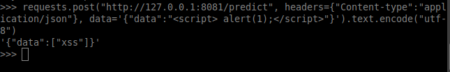

# Malicious Payload Indentification

## With machine learning !

Rest API for malicious payload validation using machine learning

# Examples

## Request

    POST /predict
    Content-type: application/json

    {
        "data": "payload_here"
    }

## Response

    {
        "data":"Xss"
    }

